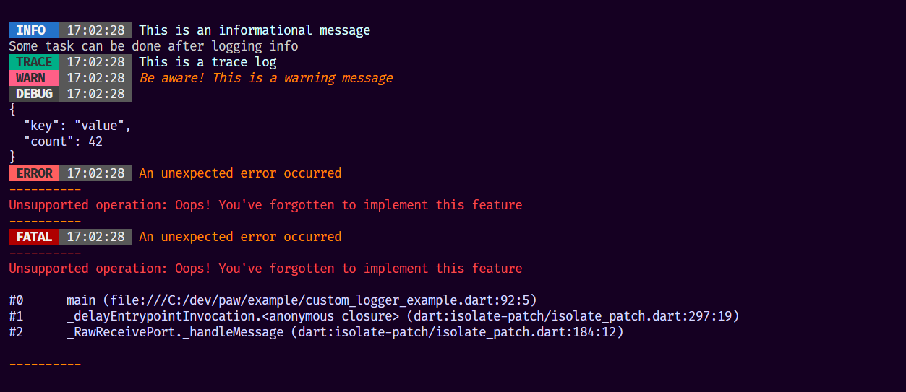
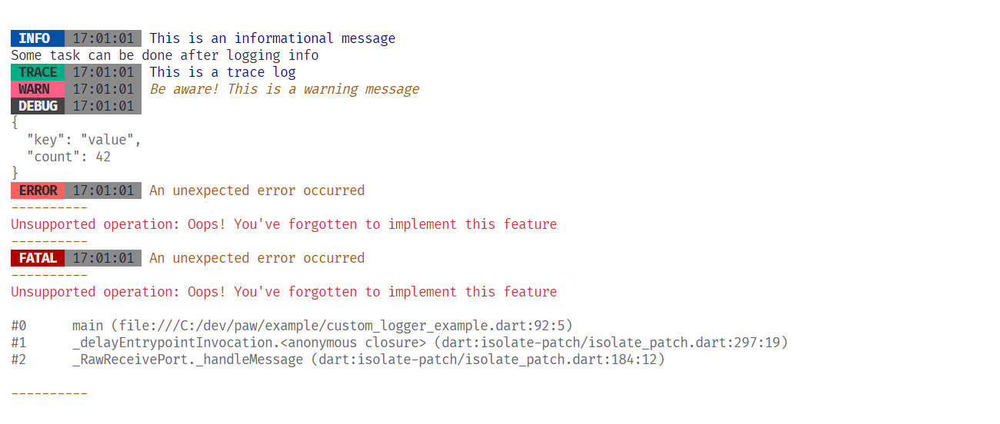

# PAW 🐾

[](https://pub.dev/packages/paw)
[](https://github.com/AdityaMotale/paw/actions)
[](https://github.com/AdityaMotale/paw/commits/main)
[](https://github.com/AdityaMotale/paw/pulls)
[](https://github.com/AdityaMotale/paw/issues)
[](https://github.com/AdityaMotale/paw)
[](https://github.com/AdityaMotale/paw/blob/main/LICENSE)

Paw 🐾 is a logging tool that prioritizes accessibility and readability, while also offering highly customizable logs

### Quick Links

- [Installation](#installation)
- [Getting Started](#getting-started)
- [Log Levels](#log-levels)
- [Themes](#themes)
- [Custom Themes](#custom-themes)
- [Efficient Usage Practices](#efficient-usage-practices)
- [Contributing](#contributing)

## Installation

You can directly install Paw 🐾 by adding `paw: ^0.0.4` to your _pubspec.yaml_ dependencies section

You can also add Paw 🐾 to your project by executing,

- For Flutter Project - `flutter pub add paw`
- For Dart Project - `dart pub add paw`

## Getting Started

Getting started with Paw 🐾 is easy! You can integrate it into your project by fallowing ways:

- [Using the `Paw` class directly](#paw)
- [Creating a custom logger via `PawInterface`](#pawinterface)

### Paw

The `Paw` class offers a straightforward approach to logging in your project. Simply instantiate the `Paw` class and utilize its various methods for logging. Have a look at example below,

```dart

import 'package:paw/paw.dart';

///
/// Create an instance of [paw] with custom configurations.
///
final paw = Paw(
  // optional, defaults to [PAW]
  title: "MyApp",

  // optional, defaults to [true]
  shouldIncludeSourceFileInfo: true,

  // optional, defaults to [true]
  shouldIncludeTitle: true,

  // optional, defaults to [true]
  shouldPrint: true,

  // optional, defaults to [5]
  stackTraceToPrint: 5,

  // optional, defaults to [PawDarkTheme]
  theme: PawDarkTheme(),

  // Note: When the `level` is set to [null], Paw is allowed to print logs
  // of all levels. To only print logs of a certain level, set the `level` to
  // that specific level, e.g. [PawLogLevels.fetal] to only print fetal logs

  level: null, // this allows paw to print all the logs, defaults to [null]
);

```

For more details on how to use `Paw` class, have a look at this [example](./example/main.dart).

> **👉 NOTE:** To maintain consistency and avoid redundancy, it's not recommended to create a new instance of `Paw` for every class or function. More details [here](#using-a-global-instance)

### PawInterface

`PawInterface` allows for more control over the logging process in Paw 🐾. You can implement your custom logger as fallows:

```dart

import 'package:paw/paw.dart';

///
/// [MyLogger] is a custom logger class created with [PawInterface] to help
/// enhance the functionality of Paw 🐾
///
class MyLogger extends PawInterface {
  ///
  /// All the fields are optional, you can edit them according to your needs
  ///
  MyLogger({
    super.name = "MyApp",
    super.maxStackTraces = 5,
    super.shouldIncludeSourceInfo = false,
    super.shouldPrintLogs = true,
    super.shouldPrintName = false,
  }) : super(
          currentTheme: PawDarkTheme(),
        );

  ///
  /// You can override all the log levels to enhance their functionality
  ///
  @override
  void info(String msg, {StackTrace? stackTrace}) {
    super.info(msg, stackTrace: stackTrace);

    // Optional: Additional functionality after logging.
    print("Custom actions after logging info");
  }

  //
  // You can override any log level to enhance its functionality
  //
}

```

Similar to using `Paw` class, you can use `MyLogger` in the same way. For more details, have a look at this
[example](./example/custom_logger_example.dart).

> **👉 NOTE:** Try to create global variable to access `MyLogger` or convert `MyLogger` into a singleton to avoid redundancy. More details [here](#implementing-a-singleton-pawinterface)

## Log Levels

Below are various logging levels provided by `Paw`,

### `info`

Log an informational message. Use this for general app flow information, which could be helpful for
understanding the app's behavior.

```dart

///
/// Log an informational message.
///
/// Use this for general app flow information, which could be helpful for
/// understanding the app's behavior.
///
paw.info("This is an informational message");

```

### `trace`

Log a tracing message. Use this for tracking code flow and high-volume logs

```dart

///
/// Log a tracing message
///
/// Use this for tracking code flow and high-volume logs
///
paw.trace("This is a trace log");

```

### `warn`

Log a warning message. Use this for non-critical issues that should be noted.

```dart

///
/// Log a warning message.
///
/// Warn logs are useful for non-critical issues that should be
/// brought to attention.
///
paw.warn("Be aware! This is a warning message");

```

### `debug`

Log a data object for debugging. Essential for troubleshooting and understanding complex data
objects in your code.

```dart

///
/// Log a data object for debugging.
///
/// This is particularly useful for logging structured data, making it
/// easier to understand complex data states.
///
paw.debug({'key': 'value', 'count': 42});

```

### `error`

Log an error with additional context. Use this for logging exceptions or errors that occur in your application.

```dart

///
/// Log an error with additional context.
///
/// Here you can pass a message, an error object for in-depth debugging.
///
/// Use this for logging exceptions or errors that occur in your application.
///
try {
  throw UnsupportedError("Oops! You've forgotten to implement this feature");
} catch (e) {
  // Log an error with a message and error object
  paw.error(
    'An unexpected error occurred',
    error: e,
  );
}

```

### `fetal`

Log an error with additional context such as a message, an error object, and even a stack trace
for in-depth debugging. Use this for logging critical exceptions or errors that may break your application.

```dart

///
/// Log an error with additional context.
///
/// Here you can pass a message, an error object, and even a stack trace
/// for in-depth debugging.
///
/// Use this for logging exceptions or errors that occur in your application.
///
try {
  throw UnsupportedError("Oops! You've forgotten to implement this feature");
} catch (e, stackTrace) {
  // Log a fetal log with a message, error object, and stack trace
  paw.fetal(
    'A very serious error occurred',
    stackTrace: stackTrace,
    error: e,
  );
}

```

## Themes

To increase accessability and readability of the logs, Paw 🐾 provides two themes out of the box,

- [PawDarkTheme](#pawdarktheme)
- [PawLightTheme](#pawlighttheme)

### `PawDarkTheme`

`PawDarkTheme` is suitable option when your device or code editor has a dark theme. Look at the
example below to use `PawDarkTheme`,

```dart

import 'package:paw/paw.dart';

///
/// Create an instance of [Paw] with [PawDarkTheme]
///
final paw = Paw(
  theme: PawDarkTheme(),
);

```



### `PawLightTheme`

`PawLightTheme` is suitable option when your device or code editor has a light theme. Look at the
example below to use `PawLightTheme`,

```dart

import 'package:paw/paw.dart';

///
/// Create an instance of [Paw] with [PawLightTheme]
///
final paw = Paw(
  theme: PawLightTheme(),
);

```



## Custom Themes

To customise colors of the logs, you can create your own theme by using `PawCustomTheme` class.

Paw provides various ANSI colors out of the box to help you create your themes, you can use `AnsiForegroundColors` and
`AnsiBackgroundColor` respectively to create your themes. You can also bring your own colors to your theme by using the
available `custom` function on both of the colors classes.

Look at the example below to create your own custom theme,

```dart

import 'package:paw/paw.dart';

///
/// Custom theme created using [PawCustomTheme] to customise colors of the logs
/// printed on the consol with [Paw]
///
final kCustomTheme = PawCustomTheme(
  heading: AnsiForegroundColors.black,
  message: AnsiForegroundColors.softPink,
  object: AnsiForegroundColors.gray,
  errorMessage: AnsiForegroundColors.orange,
  errorObject: AnsiForegroundColors.red,
  bgWarn: AnsiBackgroundColor.lightGray,
  bgInfo: AnsiBackgroundColor.blue,
  bgTrace: AnsiBackgroundColor.darkPink,
  bgDebug: AnsiBackgroundColor.gray,
  bgError: AnsiBackgroundColor.darkPink,
  bgFetal: AnsiBackgroundColor.brown,
  infoCardBg: AnsiBackgroundColor.custom(r: 204, g: 255, b: 153),
);

///
/// Create an instance of [Paw] with [kCustomTheme]
///
final paw = Paw(
  theme: kCustomTheme,
);

```

For more details on how to create and use your custom themes, have a look at this
[example](./example/custom_theme_example.dart).

## Efficient Usage Practices

To maintain consistency and avoid redundancy, it's not recommended to create a new instance of `Paw` for every class or function. Doing so can lead to issues with maintaining standard configurations throughout your application.

For instance, if you decide to change a configuration, like hiding _source file info_ or disabling _log printing_, modifying every `Paw` instance becomes impractical.

To address this, consider one of the following approaches:

### Using a Global Instance

Creating a global instance of `Paw` helps avoid the creation of multiple instances with varying configurations. This approach promotes consistency and ease of configuration management.

```dart

import 'package:paw/paw.dart';

///
/// Create a global immutable / constant instance of [Paw] with custom configurations.
///
final kPaw = Paw(
  // optional, defaults to [PAW]
  title: "MyApp",

  // optional, defaults to [true]
  shouldIncludeSourceFileInfo: true,

  // optional, defaults to [true]
  shouldIncludeTitle: true,

  // optional, defaults to [true]
  shouldPrint: true,

  // optional, defaults to [5]
  stackTraceToPrint: 5,

  // optional, defaults to [PawDarkTheme]
  theme: PawDarkTheme(),

  // Note: When the `level` is set to [null], Paw is allowed to print logs
  // of all levels. To only print logs of a certain level, set the `level` to
  // that specific level, e.g. [PawLogLevels.fetal] to only print fetal logs

  level: null, // this allows paw to print all the logs, defaults to [null]
);

```

### Implementing a Singleton PawInterface

If global variables don't align with your project's architecture, or you prefer a more encapsulated approach,
a singleton implementation of `PawInterface` is a viable alternative.

```dart
import "package:paw/paw.dart";

///
/// Singleton [MyLogger] class.
///
class MyLogger extends PawInterface {
  // Private constructor to prevent external instantiation.
  MyLogger._({
    required super.name,
    required super.maxStackTraces,
    required super.shouldIncludeSourceInfo,
    required super.shouldPrintLogs,
    required super.shouldPrintName,
    required super.theme,
    required super.level,
  });

  // Static instance for external access.
  static MyLogger? _instance;

  // Public factory constructor.
  factory MyLogger() {
    // Initialize the instance if it hasn't been already.
    _instance ??= MyLogger._(
      name: "MyApp",
      maxStackTraces: 5,
      shouldIncludeSourceInfo: true,
      shouldPrintLogs: true,
      shouldPrintName: true,
      theme: PawDarkTheme(),
      level: null,
    );

    return _instance!;
  }

  @override
  void info(String msg, {StackTrace? stackTrace}) {
    super.info(msg, stackTrace: stackTrace);

    // Optional: Additional functionality after logging.
    print("Custom actions after logging info");
  }
}
```

## Contributing

We welcome contributions! If you'd like to improve Paw 🐾, please open an issue or an PR with
your suggested changes in this [repo](https://github.com/AdityaMotale/paw). Happy Coding 🤝!
