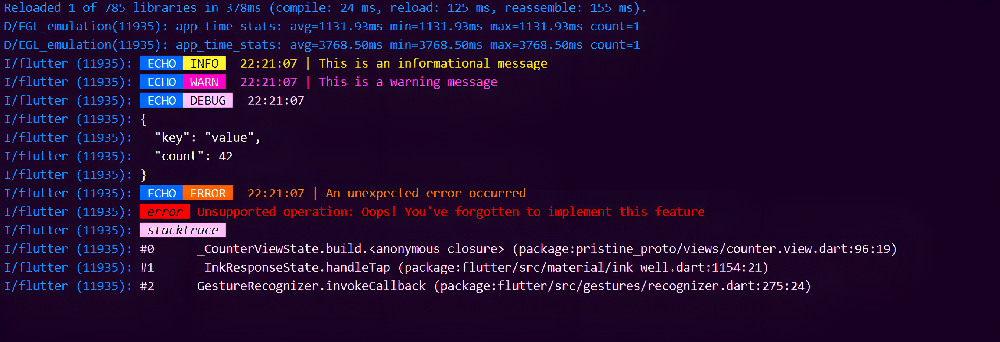

# PAW 🐾

[](https://pub.dev/packages/paw)
[](https://github.com/AdityaMotale/paw/actions)
[](https://github.com/AdityaMotale/paw/commits/main)
[](https://github.com/AdityaMotale/paw/pulls)
[](https://github.com/AdityaMotale/paw)
[](https://github.com/AdityaMotale/paw/blob/main/LICENSE)

Paw is a compact, well-organized, and user-friendly logging tool for your apps. It's designed to log your code's journey with structure and clarity, leaving a trace of each step like a paw print.

### Quick Links

- [Installation](#installation)
- [Getting Started](#getting-started)
- [Outputs](#outputs)
- [Documentation](#documentation)
- [Advanced Guide](#)
- [Contributing](#contributing)
- [GitHub Repository](https://github.com/AdityaMotale/paw)

## Installation

You can directly install it by adding `paw: ^0.0.3` to your _pubspec.yaml_ dependencies section or you can also add Paw 🐾 to your project by executing,

- For Flutter Project - `flutter pub add paw`
- For Dart Project - `dart pub add paw`

## Getting Started

Integrate _Paw_ into your Flutter projects in two distinct ways:

- [Using the `Paw` class directly](#paw)
- [Creating a custom logger via `PawInterface`](#pawinterface)

### Paw

The `Paw` class offers a straightforward approach to logging in your project.

Simply instantiate the `Paw` class and utilize its various methods such as `warn`, `info`, `debug`, and `error` for logging. Consider the following example:

```dart
import 'package:paw/paw.dart';

void main() {
  // Create an instance of [Paw] with customized settings.
  final paw = Paw(
    title: "MyApp",
    shouldIncludeSourceFileInfo: true,
    shouldIncludeTitle: true,
    shouldPrint: true,
    stackTraceToPrint: 5,
  );

  // Log an informational message.
  paw.info("This is an informational message");

  // Log a warning message.
  paw.warn("Be aware! This is a warning message");

  // Log a debugging data object.
  paw.debug({'key': 'value', 'count': 42});

  // Log an error with additional context.
  try {
    throw UnsupportedError("Oops! You've forgotten to implement this feature");
  } catch (e, stackTrace) {
    // Log an error with a message, error object, and stack trace.
    paw.error(
      'An unexpected error occurred',
      stackTrace: stackTrace,
      error: e,
    );
  }
}
```

For more details on how to use `Paw` logger, have a look at this [example](./example/main.dart).

> To maintain consistency and avoid redundancy, it's not recommended to create a new instance of `Paw` for every class or function. More details [here](#using-a-global-instance)

### PawInterface

`PawInterface` allows for more tailored control over the logging process in your applications. Implement your custom logger as follows:

```dart
import 'package:paw/paw.dart';

class CustomLogger extends PawInterface {
  CustomLogger({
    super.name = "MyApp",
    super.maxStackTraces = 5,
    super.shouldIncludeSourceInfo = false,
    super.shouldPrintLogs = true,
    super.shouldPrintName = true,
  });

  @override
  void info(String msg, {StackTrace? stackTrace}) {
    super.info(msg, stackTrace: stackTrace);

    // Add custom behavior when logging information.
    // Example: Integrate additional functionality such as crash reporting.
    print("Additional tasks after logging info");
  }
}
```

Similar to using `Paw` class, you can use your own `CustomLogger` in the same way, as fallowing,

```dart
void main() {
  // Instantiate your [CustomLogger].
  final logger = CustomLogger();

  // Log an informational message.
  logger.info("This is an informational message");

  // Log a warning message.
  logger.warn("Be aware! This is a warning message");

  // Log a debugging data object.
  logger.debug({'key': 'value', 'count': 42});

  // Log an error with additional context.
  try {
    throw UnsupportedError("Oops! You've forgotten to implement this feature");
  } catch (e, stackTrace) {
    // Log an error with a message, error object, and stack trace.
    logger.error(
      'An unexpected error occurred',
      stackTrace: stackTrace,
      error: e,
    );
  }
}
```

For guidance on implementing your `CustomLogger`, see this [example](./example/custom_logger_example.dart).

> Try to create global variable to access your `CustomLogger` or convert your `CustomLogger` into a singleton to avoid redundancy. More details [here](#implementing-a-singleton-customlogger)

## Outputs

Paw provides clear and organized log outputs, making debugging and monitoring an easy task. Here's an example of what Paw's outputs look like:



## Documentation

Below are various logging levels provided by `Paw`,

### `info`

Log informational messages. Ideal for general app behaviors and states.

```dart
Paw().info('This is an informational message');
```

### `warn`

Log warnings. Use this for non-critical issues that should be noted.

```dart
Paw().warn('This is a warning message');
```

### `debug`

Log debugging information. Essential for troubleshooting and understanding complex flows.

```dart
Paw().debug({'key': 'value', 'count': 42});
```

### `error`

Log errors with detailed information, including error objects and stack traces. Critical for error tracking.

```dart
try {
  // Code that might throw an error
} catch (e, stackTrace) {
  Paw().error('An unexpected error occurred', error: e, stackTrace: stackTrace);
}
```

## Efficient Usage Practices

To maintain consistency and avoid redundancy, it's not recommended to create a new instance of `Paw` for every class or function. Doing so can lead to issues with maintaining standard configurations throughout your application.

For instance, if you decide to change a configuration, like hiding _source file info_ or disabling _log printing_, modifying every `Paw` instance becomes impractical.

To address this, consider one of the following approaches:

### Using a Global Instance

Creating a global instance of `Paw` helps avoid the creation of multiple instances with varying configurations. This approach promotes consistency and ease of configuration management.

```dart
import "package:paw/paw.dart";

// Global instance of [Paw] with custom configurations.
// This instance can be accessed throughout your application.
final paw = Paw(
  title: "MyApp",
  shouldIncludeSourceFileInfo: true,
  shouldIncludeTitle: true,
  shouldPrint: true,
  stackTraceToPrint: 5,
);
```

### Implementing a Singleton CustomLogger

If global variables don't align with your project's architecture, or you prefer a more encapsulated approach, a singleton `CustomLogger` is a viable alternative.

```dart
import "package:paw/paw.dart";

///
/// Singleton [CustomLogger] class.
///
class CustomLogger extends PawInterface {
  // Private constructor to prevent external instantiation.
  CustomLogger._({
    required super.name,
    required super.maxStackTraces,
    required super.shouldIncludeSourceInfo,
    required super.shouldPrintLogs,
    required super.shouldPrintName,
  });

  // Static instance for external access.
  static CustomLogger? _instance;

  // Public factory constructor.
  factory CustomLogger() {
    // Initialize the instance if it hasn't been already.
    _instance ??= CustomLogger._(
      name: "MyApp",
      maxStackTraces: 5,
      shouldIncludeSourceInfo: true,
      shouldPrintLogs: true,
      shouldPrintName: true,
    );

    return _instance!;
  }

  @override
  void info(String msg, {StackTrace? stackTrace}) {
    super.info(msg, stackTrace: stackTrace);

    // Optional: Additional functionality after logging.
    print("Custom actions after logging info");
  }
}
```

## Contributing

We welcome contributions! If you'd like to improve _Paw_, please open an issue or an PR with your suggested changes on this [repo](https://github.com/AdityaMotale/paw). Happy Coding 🐾!
